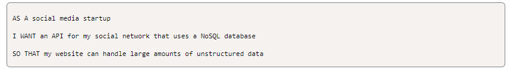

# **Welcome to my Social Network: What's the Word?**

#

## *Table of Contents:*

    * [Description](#description)
    * [Usage](#usage)
    * [User Story](#user-story)
    * [Demonstration of App](#demonstration-of-application)
    * [Tech](#technologies-used)
    * [References](#references)
    * [Author](#author)

#

### *Description:*

- **Hello There! In this repository I have developed a social networking App that uses MongoDB to run the database and NoSQL methods to push the data through. The user has the ability to leave comments on any topic (What is on their mind?, Important Events, etc.) while also allowing the user to leave reactions to those comments that are posted in the database. Application has been fully tested in *[Insomnia](https://insomnia.rest/products/insomnia)* for functionality.**

#

### *Usage:*

* Clone the repository in Github.

* You must have *[MongoDB](https://www.mongodb.com/)* installed in order to run the server for the database of this application.

* To begin the User will navigate to the integrated command terminal and input `npm init` to install the necessary packages and dependencies to run the application.

* The user will also need to input:
    * `npm i mongoose` to install Mongoose.
    * `npm i express` to install Express.
    * `npm i nodemon` to install Nodemon.

* After all necessary packages are installed the User can input either `npm start` or to see consistency in the sever stability input `npm run watch` to initialize and start the application.

* The Demonstration of Usage will show how to use the application in Insomnia. But for reference:

    * To create a new **User** you must input in the **JSON** field:

        `{ "username" : " *Insert User Name Here* ", "email" : " *Insert Email Here* "}`
    
    * To create a new **Word** you must input in the **JSON** field:

        `{ "wordText" : " *Insert Word Text Here* ", "userId" : " *Insert User Id Here* "}`

    *  To add a **Friend** to a **User** in the database you must specify the Id of the **User** you want to add as a **Friend**. You must send a `POST` route through Insomnia referencing the `userId` and following with `/friends` to conclude it with the `userId` of the **User** that is to be added.

        *Example:* `http://localhost:3001/api/users/636ef0a5fe0de5c4033ae156/friends/636ef256cacac23ee98032df`

        - *1st username:* `Bob Billy`
        - *1st userId:* `636ef0a5fe0de5c4033ae156`

        - *2nd username:* `Bobby Bill`
        - *2nd userId:* `636ef256cacac23ee98032df`

    The end result should be that in the preview of Insomnia, the `friendCount` increases by 1.
    
    * To add a **Reaction** to a **User**'s **Word**. The user must reference the `wordId` and `reactionId` in the http route. Then in the **JSON** field, you will input:

        `{ "wordText" : " *Insert Reaction Text Here* ", "userId" : " *Insert User Id Here* "}`

    * To delete a **Reaction**, **Word** or **User**. The user will just need to locate the respective Id for the Object you want to delete, then push a delete command through on Insomnia after you reference the correct Id for the Object.

    * To Update a **Word** or **User**. The user will just need to locate the respective Id for the Object you want to update.

        - *Word* : Reference the Id in the http route. Then in the **JSON** field, you will input:

        `{ "wordText" : "*Insert Updated Text Here*" }`

        - *User* : Reference the Id in the http route. Then in the **JSON** field, you will input:

        `{ "username" : " *Insert Updated Username Here* ", "email" : " *Insert Updated User Email Here* "}`

#

### *USER STORY:*

#

### *Demonstration of Application*

- **[Demonstration of Usage]()**

#

### *Technologies Used:*

* [Javascript](https://www.javascript.com/)
* [Node.js](https://nodejs.org/en/)
* [Insomnia](https://insomnia.rest/products/insomnia)
* [MongoDB](https://www.mongodb.com/)
* [Mongoose](https://mongoosejs.com/docs/)
* [Express](https://expressjs.com/)
* [Sequelize](https://sequelize.org/)
* [Nodemon](https://nodemon.io/)

#

#### *References*

- **[The Coding Boot Camp of UT-Austin](https://techbootcamps.utexas.edu/coding/)**

#

#### *Author*

**Charles Breven Glasgow**

- **[GitHub](https://github.com/Brevenn)**
- **[LinkedIn](https://www.linkedin.com/in/charles-glasgow-7b07a41a3/)**
- **[Portfolio](https://brevenn.github.io/Portfolio-Full-Stack/)**

#